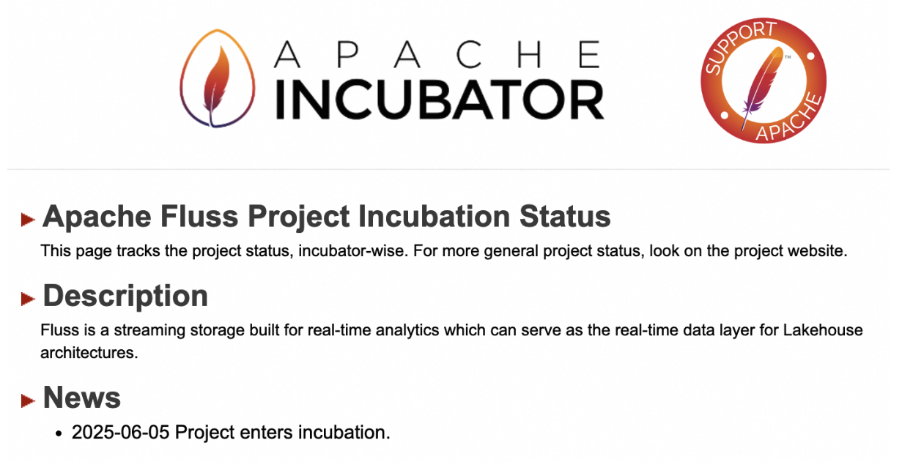
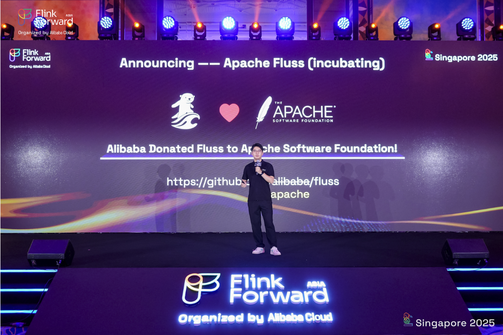
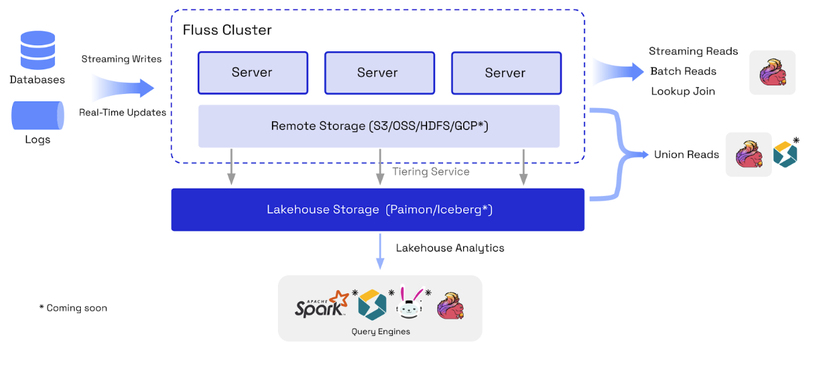

On June 5th, Fluss, the next-generation streaming storage project open-sourced and donated by Alibaba, successfully passed the [vote](https://lists.apache.org/thread/mnol4wxovpz6klt196d3x239t4mp6z5o) and officially became an incubator project of the Apache Software Foundation (ASF). This marks a significant milestone in the development of the Fluss community, symbolizing that the project has entered a new phase that is more open,
neutral, and standardized. Moving forward, Fluss will leverage the ASF ecosystem to accelerate the building of a global developer community, continuously driving innovation and adoption of next-generation real-time data infrastructure.

<!-- truncate -->

The Fluss community has recently completed all donation procedures and successfully transferred the project to the Apache Software Foundation.
During the keynote speech at Flink Forward Asia 2025, held on July 3rd in Singapore, project creator Jark Wu officially announced the exciting news, 
sharing the new [repository address](https://github.com/apache/fluss/) and the [official website domain](https://fluss.apache.org/).

### What is Fluss?

Apache Fluss (incubating) is a next-generation streaming storage designed for real-time analytics scenarios. 
It aims to address the high costs and inefficiencies of traditional streaming storage technologies in stream processing and Lakehouse architectures. 
It offers the following core features:

* **Columnar Streaming Storage:** Supports real-time streaming read and write with millisecond-level latency. Real-time streaming data is stored in the Apache Arrow columnar format to leverage query pushdown technologies such as column pruning and partition pruning during streaming read. It improves read performance by up to 10 times and reduces network costs.
* **Real-Time Updates and Lookup Queries:** Innovatively introduces real-time update capabilities into stream storage. Through high-performance streaming updates, partial updates, changelog feed, key-value lookup, and DeltaJoin features, it collaborates efficiently with Flink to build a cost-effective, real-time streaming data warehouse.
* **Streaming Lakehouse:** Achieves unified storage of data lakehouse and data streams, enabling data sharing between them. The Lakehouse provides low-cost historical data support for streams, while streams inject real-time data capabilities into the Lakehouse, delivering real-time data analysis experiences to the Lakehouse.

### The Two-Year Journey
In July 2023, the Flink team at Alibaba Cloud launched the Fluss project. 
The name **"Fluss"** is derived from the abbreviation of "**Fl**ink **U**nified **S**treaming **S**torage", signifying its mission to build a unified streaming storage foundation for Apache Flink.
Coincidentally, "Fluss" means **"river"** in German, symbolizing the continuous flow of data.

After more than a year of internal incubation and refinement, Alibaba officially announced the open-sourcing of the Fluss project on November 29, 2024, during the keynote speech at Flink Forward Asia 2024 in Shanghai.
Since then, Fluss has embarked on a path of diverse and international development, attracting contributions from more than 60 developers worldwide.
The community’s activity has been steadily growing, with a major version released approximately every three months.

At the same time, Fluss has achieved large-scale adoption within Alibaba Group. 
Currently, it supports **data scales of over 3 PB**, with a cluster **throughput peak of 40 GB/s**, and a maximum single-table **lookup query QPS of up to 500,000 per second**, and single-table data volume **reaching up to 500 billion rows**. 
In key business scenarios such as log collection and analysis, search recommendation, and real-time data warehouses, Fluss has demonstrated outstanding performance and capabilities.

### Why Apache?
The Apache Software Foundation (ASF) is the cradle of global open-source big data technologies, nurturing numerous world-changing projects such as Hadoop, Spark, Iceberg, Kafka, and Flink. Fluss looks forward to joining the ASF and becoming a part of the movement that shapes the future of real-time infrastructure. At the same time, Fluss has a strong need for deep integration with these Apache projects, and joining the ASF will accelerate the integration process within the ecosystem. More importantly, the ASF's core values of openness, collaboration, and neutrality align closely with Fluss's vision. By joining the Apache Incubator, we align with this spirit and gain access to a larger community, better governance, and long-term sustainability.

### Special Thanks
Special thanks to the Fluss incubation mentors for their valuable support and guidance during the project's journey into the ASF Incubator.

* **@Yu Li (Champion):** PMC member of Flink and HBase projects, experienced mentor of multiple open-source projects, and successfully guided top-level projects such as Apache Paimon and Apache Celeborn.
* **@Jingsong Lee:** Chair of the Apache Paimon PMC and member of the Apache Flink PMC. 
* **@Zili Chen:** A seasoned mentor of multiple open-source projects, PMC member of Pulsar, Zookeeper and Curator. He also serves as a member of the Apache Board in 2025. 
* **@Becket Qin:** An active mentor of multiple open-source projects and PMC member of projects including Apache Flink and Apache Kafka. 
* **@Jean-Baptiste Onofré:** Karaf PMC Chair, PMC on ACE, ActiveMQ, Archiva, Aries, Beam, Brooklyn, Camel, Felix, Incubator. He is also the incubation champion for Apache Polaris.

We would also like to express our gratitude to all contributors of the Fluss community!

### Join the Surfing
We sincerely invite developers and users who are interested in Fluss to join our open-source community and help drive the project forward. We look forward to your participation!

* GitHub Repository: https://github.com/apache/fluss/  (give it some ❤️ via ⭐)
* Official Website: https://fluss.apache.org/
* Slack: [Apache Fluss ](https://join.slack.com/t/apache-fluss/shared_invite/zt-33wlna581-QAooAiCmnYboJS8D_JUcYw)
* Mailing List: `dev@fluss.apache.org` (by sending any mail to `dev-subscribe@fluss.apache.org` to subscribe)