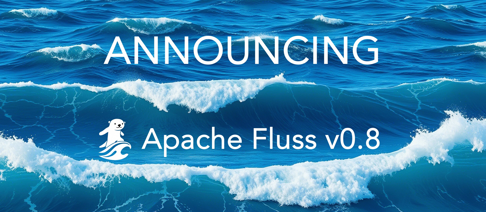
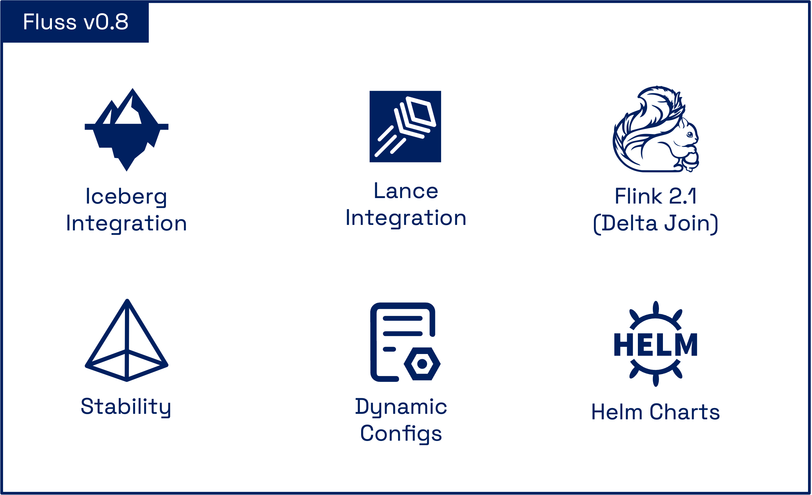
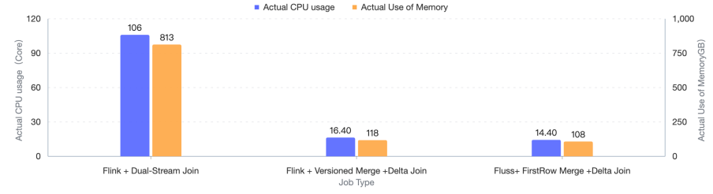
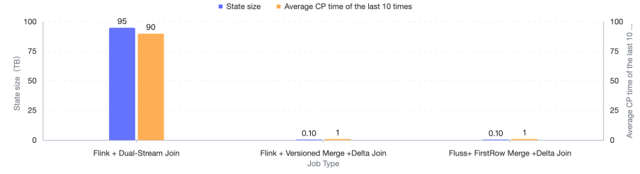

🌊 We are excited to announce the official release of **Fluss 0.8**!

This is the first ASF release for Apache Fluss (incubating), marking a significant milestone in our journey to provide a robust streaming storage platform for real-time analytics.
Over the past four months, we’ve delivered lots of improvements and new capabilities, with more than 390+ commits, across the Streaming Lakehouse ecosystem,
including: deeper integration with Apache Flink, extensive improvements in the Streaming Lakehouse with support for [Apache Iceberg](https://iceberg.apache.org/) and [Lance](https://github.com/lancedb/lance),
and the introduction of [Delta Joins](https://cwiki.apache.org/confluence/display/FLINK/FLIP-486%3A+Introduce+A+New+DeltaJoin), which redefine efficiency in stream processing.

Apache Fluss 0.8 marks a new era of **real-time**, **unified**, and **zero-state streaming**, designed to power the next generation of data platforms, focusing on performance, scalability, and simplicity of the overall architecture.

<!-- truncate -->



## Streaming Lakehouse for Iceberg

A key highlight of Fluss 0.8 is the introduction of **Streaming Lakehouse for Apache Iceberg** ([FIP-3](https://cwiki.apache.org/confluence/display/FLUSS/FIP-3%3A+Support+tiering+Fluss+data+to+Iceberg)),
which transforms Iceberg from a batch-oriented table format into a continuously updating Lakehouse. Apache Fluss acts as the **real-time ingestion and storage layer**, writing fresh data and updates into Iceberg with guaranteed ordering and exactly-once semantics.

This enables real-time data on Fluss to be tiered as Apache Iceberg tables, while providing table semantics like partitioning and bucketing on a single copy of data.
Moreover, it solves Iceberg’s long-standing update limitations through Fluss’s **native support for upserts and deletes** and its **built-in compaction service**,
which automatically merges small files and maintains optimized Iceberg snapshots.

Key benefits include:
- **Unified Architecture**: Fluss handles sub-second streaming reads and writes, while Iceberg stores compacted historical data.
- **Native Updates and Deletes**: Fluss efficiently applies changes and tiers them into Iceberg without rewrite jobs.
- **Built-in Compaction Service**: The built-in service maintains snapshot efficiency with no external tooling.
- **Efficient Backfilling**: Enables lightning-fast backfill of historical data from Iceberg for streaming processing.
- **Lower Cost**: Reduce storage cost by tiering cold data to Iceberg while keeping hot data in Fluss, eliminating the need for duplicate storage.
- **Lower Latency**: Sub-second data freshness for Iceberg tables by Union Read from Fluss and Iceberg.

```yaml title='server.yaml'
# Iceberg configuration
datalake.format: iceberg

# the catalog config about Iceberg, assuming using Hadoop catalog,
datalake.iceberg.type: hadoop
datalake.iceberg.warehouse: /path/to/iceberg
```

You can find more detailed instructions in the [documentation](/docs/next/streaming-lakehouse/integrate-data-lakes/iceberg/).

## Real-Time Multimodal AI Analytics with Lance

Another major enhancement in Fluss 0.8 is the addition of **Streaming Lakehouse support for [Lance](https://github.com/lancedb/lance)** ([FIP-5](https://cwiki.apache.org/confluence/display/FLUSS/FIP-5%3A+Support+tiering+Fluss+data+to+Lance),
a modern columnar and vector-native data format designed for AI and machine learning workloads.
This integration extends Apache Fluss towards being a real-time ingestion platform for multi-modal data & AI,
not just traditional tabular streams, but also embeddings, vectors, and unstructured features used in AI systems.
With this release, Fluss can continuously ingest, update, and tier data into Lance tables with guaranteed ordering and freshness,
enabling fast synchronization between streaming pipelines and downstream ML or retrieval applications.

Key benefits include:

- **Unified multi-modal data ingestion**: Stream tabular, vector, and embedding data into Lance in real time.
- **AI/ML-ready storage**: Keep feature vectors and embeddings continuously up-to-date for model training or inference.
- **Low-latency analytics and retrieval**: Fast, continuous updates enable Lance data to be immediately usable for real-time search and recommendation.
- **Simplified architecture**: Eliminates complex ETL pipelines between streaming systems and vector databases.

Seamless integration: combines Fluss’s high-throughput streaming engine with Lance’s efficient columnar persistence for consistent, multi-modal data management.

```yaml title='server.yaml'
datalake.format: lance
datalake.lance.warehouse: s3://<bucket>
datalake.lance.endpoint: <endpoint>
datalake.lance.allow_http: true
datalake.lance.access_key_id: <access_key_id>
datalake.lance.secret_access_key: <secret_access_key>
```

See the [LanceDB blog post](https://lancedb.com/blog/fluss-integration/) for the full integration. You also can find more detailed instructions in the [documentation](/docs/next/streaming-lakehouse/integrate-data-lakes/lance/).

## Flink 2.1

Apache Fluss is now fully compatible with **Apache Flink 2.1**, ensuring seamless integration with the latest Flink runtime and APIs.
This update strengthens Fluss’s role as a unified streaming storage layer, providing reliable performance and consistency for modern data pipelines built on Flink.

### Delta Join

The Delta Join is a major step towards the era of zero-state streaming joins. This release introduces support for Delta Joins with Apache Flink.
By externalizing state into Fluss tables, Flink performs joins incrementally on data deltas, without maintaining large states.
This architecture reduces CPU and memory usage by **up to 80%**, eliminates over **100 TB of state** as witnessed in the first production use cases from [early adopters](blog/2025-08-07-taobao-practice.md),
and cuts checkpoint durations from **90 seconds to just 1 second**. Because all data lives natively in Fluss tables,
there’s **no state bootstrapping**; pipelines start instantly, stay lightweight, and achieve efficiency for real-time analytics at scale.

Below is a performance comparison (CPU, memory, state size, checkpoint interval) between Delta Join and Stream-Stream Join, as evaluated by Taobao’s Search & Recommendation Systems team.






TODO: add documentation link

### Materialized Table

Apache Fluss 0.8 introduces support for Flink Materialized Tables, enabling seamless, low-latency materializations directly over Fluss streams.
Flink’s Materialized Table turns a SQL query into a continuously or periodically refreshed result table with a defined freshness target (e.g., seconds or minutes).
With Fluss as the underlying streaming source, users can declaratively build real-time tables that stay up to date without custom orchestration.
This integration unifies batch and streaming ETL: Fluss delivers high-throughput, low-latency data, while Flink continuously maintains derived tables for analytics,
APIs, and downstream workloads, providing real-time, consistent data pipelines with minimal operational overhead.
This integration further strengthens the batch & stream unification.

```sql title="Flink SQL"
-- 1. create a materialized table with 10 seconds freshness
CREATE MATERIALIZED TABLE fluss.dw.sales_summary
FRESHNESS = INTERVAL '10' SECOND
AS SELECT
  product,
  SUM(quantity) AS total_sales,
  CURRENT_TIMESTAMP() AS last_updated
FROM fluss.dw.sales_detail
GROUP BY product;

-- 2. suspend data refresh for the materialized table
ALTER MATERIALIZED TABLE dwd_orders SUSPEND;

-- 3. resume data refresh for the materialized table
ALTER MATERIALIZED TABLE dwd_orders RESUME
-- Set table option via WITH clause
WITH(
 'sink.parallelism' = '10'
);
```

TODO: add documentation link


## Stability

In this release, we have made significant improvements in the stability and reliability of Apache Fluss under large-scale production workloads.
Through continuous validation across multiple business units within Alibaba Group, and especially through large-scale workloads during the Alibaba's Double 11 peak traffic, we have resolved over 35 stability-related issues.
These improvements substantially enhance Fluss’s robustness in mission-critical streaming use cases.

Key improvements include:
- **Graceful Shutdown**: Introduced a graceful shutdown mechanism for TabletServers. During shutdown, leadership is proactively migrated before termination, ensuring that read/write latency remains unaffected by node decommissioning.
- **Accelerated Coordinator Event Processing**: Optimized the Coordinator’s event handling mechanism through asynchronous processing and batched ZooKeeper operations. As a result, all events are now processed in milliseconds.
- **Faster Coordinator Recovery**: Parallelized initialization cuts Coordinator startup time from 10 minutes to just 20 seconds in production-scale benchmarks, this dramatically improves service availability and recovery speed.
- **Optimized Server Metrics**: Refined metric granularity and reporting logic to reduce telemetry volume by 90% while preserving full observability.
- **Enhanced Metadata Performance**: Addressed metadata bottlenecks during mass client restarts by strengthening the server local cache and introducing asynchronous ZooKeeper operations. This reduces metadata request latency from >10 seconds to milliseconds, ensuring stable client reconnection under load.

With these foundational stability improvements, Fluss 0.8 is now production-ready for the most demanding real-time workloads, including Alibaba’s annual Double 11 global shopping festival.

## Dynamic Configuration

### Dynamic Cluster Configs

TODO: need feature documentation

### Dynamic Table Configs

TODO: need feature documentation

## Helm Charts

This release also introduced Helm Charts. With this addition, users can now deploy and manage a full Fluss cluster using [Helm](https://helm.sh/).
The Helm chart simplifies provisioning, upgrades, and scaling by packaging configuration, manifests, and dependencies into a single, versioned release.
This should help users running Fluss on Kubernetes faster, more reliably, and with easier integration into existing CI/CD and observability setups, significantly lowering the barrier for teams adopting Fluss in production.

TODO: add documentation link

## Ecosystem

The Apache Fluss community is actively expanding Fluss beyond the JVM ecosystem with new **native clients** for Rust and Python, enabling seamless integration across modern data and AI workflows.
We’ve established an [official repository](https://github.com/apache/fluss-rust) to host both the Rust and Python clients, developed with performance, safety, and developer experience in mind:

- **🦀 Rust Client**: Built on async I/O, zero-copy columnar streaming (via Apache Arrow), and Rust’s memory safety guarantees, this client unlocks high-performance query integration with native OLAP engines like DuckDB and StarRocks.
- **🐍 Python Client**: Built as a native binding on top of the Rust client, it allows Python developers to interact with Fluss tables and streams directly from data science, ML, and analytics workflows.

The Rust and Python clients are maintained in a [separate repository](https://github.com/apache/fluss-rust) to allow for faster iteration and releases, and therefore are not part of the Fluss 0.8 release.
However, the community is actively stabilizing the clients and plans to release them soon.

## Upgrade Notes

The Fluss community tries to ensure that upgrades are as seamless as possible. However, certain changes may require users to make adjustments to certain parts of the program when upgrading to version 0.8.
Please refer to the [upgrade notes](/docs/next/maintenance/operations/upgrade-notes-0.8/) for a comprehensive list of adjustments to make and issues to check during the upgrading process.

## List of contributors
The Fluss community would like to express gratitude to all the contributors who made this release possible:

> Alibaba-HZY, CaoZhen, CenterCode, CodeDrinks, David, Giannis Polyzos, Hemanth Savasere, Hongshun Wang, Jark Wu, Jensen, Junbo Wang, Kerwin, Leonard Xu, Liebing, Maggie Cao, Mahesh Sambaram, MehulBatra, Michael Koepf, Rafael Sousa, Rion Williams, Ron, Sergey Nuyanzin, SeungMin, Wang Cheng, XianmingZhou00, Xuyang, Yang Guo, Yang Wang, Yunchi Pang, ZijunZhao, Zmm, andybj0228, buvb, cxxwang, dependabot[bot], jackylee, leosanqing, naivedogger, ocean.wy, pisceslj, totalo, xiaochen, xiaozhou, xx789, yunhong, yuxia Luo

Apache Fluss is under active development. Be sure to stay updated on the project, give it a try and if you like it,
don’t forget to give it some ❤️ via ⭐ on [GitHub](https://github.com/apache/fluss).