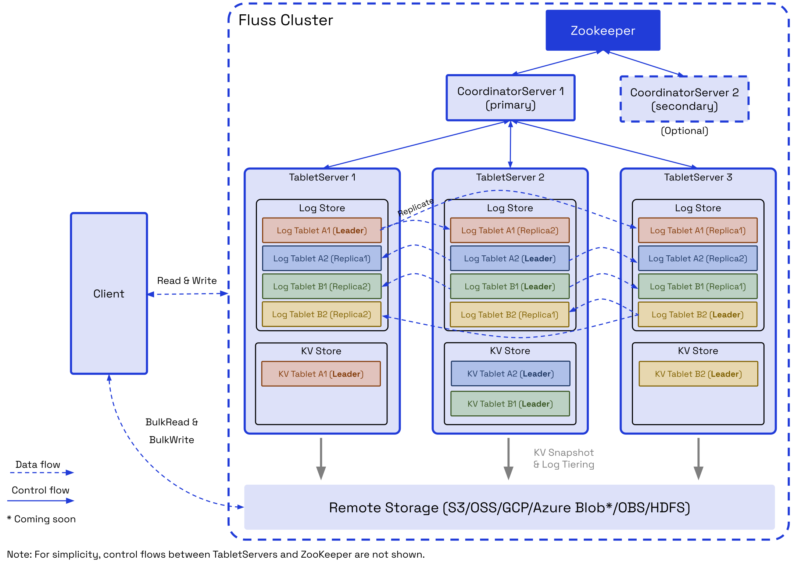

# Architecture
A Fluss cluster consists of two main processes: **CoordinatorServer** and **TabletServer**.

## CoordinatorServer
The **Coordinator Server** serves as the central control and management component of the cluster. It is responsible for maintaining metadata, managing tablet allocation, listing nodes, and handling permissions. 

Additionally, it coordinates critical operations such as:
- Rebalancing data during node scaling (upscaling or downscaling).
- Managing data migration and service node switching in the event of node failures.
- Overseeing table management tasks, including creating or deleting tables and updating bucket counts.

As the `brain` of the cluster, the **Coordinator Server** ensures efficient cluster operation and seamless management of resources.

## Tablet Server
The **Tablet Server** is responsible for data storage, persistence, and providing I/O services directly to users. It comprises two key components: **LogStore** and **KvStore**.
- For **update tables**, both `LogStore` and `KvStore` are enabled to support updates efficiently.
- For **append-only tables**, only the `LogStore` is activated, optimizing performance for write-heavy workloads.

This architecture ensures the **Tablet Server** delivers tailored data handling capabilities based on table types.

### LogStore
The **LogStore** is designed to store log data, functioning similarly to a database binlog. 
Messages can only be appended, not modified, ensuring data integrity. 
Its primary purposes are to enable low-latency streaming reads and to serve as the write-ahead log (WAL) for restoring logs in the **KvStore**.

### KvStore
The **KvStore** is used to store table data, functioning similarly to database tables. It supports data updates and deletions, enabling efficient querying and table management. Additionally, it generates comprehensive changelogs to track data modifications.

### Tablet / Bucket
Table data is divided into multiple buckets based on the defined bucketing policy.

Data for the **LogStore** and **KvStore** is stored within tablets. Each tablet consists of a **LogTablet** and, optionally, a **KvTablet**, depending on whether the table supports updates. 
Both **LogStore** and **KvStore** adhere to the same bucket-splitting and tablet allocation policies. As a result, **LogTablets** and **KvTablets** with the same `tablet_id` are always allocated to the same **Tablet Server** for efficient data management.

The **LogTablet** supports multiple replicas based on the table's configured replication factor, ensuring high availability and fault tolerance. **Currently, replication is not supported for KvTablets**.

## Zookeeper
Fluss currently utilizes **ZooKeeper** for cluster coordination, metadata storage, and cluster configuration management. 
In upcoming releases, **ZooKeeper will be replaced** by **KvStore** for metadata storage and **Raft** for cluster coordination and ensuring consistency. This transition aims to streamline operations and enhance system reliability.

## Remote Storage
**Remote Storage** serves two primary purposes:
- **Hierarchical Storage for LogStores:** By offloading LogStore data, it reduces storage costs and accelerates scaling operations.
- **Persistent Storage for KvStores:** It ensures durable storage for KvStore data and collaborates with LogStore to enable fault recovery.

Additionally, **Remote Storage** allows clients to perform bulk read operations on Log and Kv data, enhancing data analysis efficiency. It also supports bulk write operations, optimizing data import workflows for greater scalability and performance.

## Client
Fluss clients/sdks support streaming reads/writes, batch read/writes, DDL and point queries.