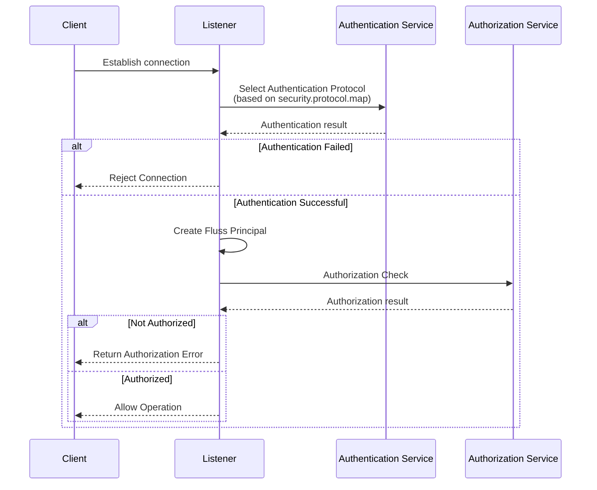

# Security Overview
Fluss provides a comprehensive security model based on two core components:
* **[Authentication](authentication.md)**: is the process of verifying the identity of the client.
* **[Authorization](authorization.md)**: controls which resources the identity can access and which operations it can perform.


By default, Fluss does not enable either authentication or authorization, which means that if these features are not explicitly configured, all clients can access the system without verification or restrictions. While this is convenient for development and testing, it is not suitable for production environments due to potential security risks.

Fluss supports **pluggable mechanisms** for both authentication and authorization, allowing users to customize security policies based on their needs.


## How Authentication Works in Fluss
### What is Authentication?
Authentication is the process of identifying who is trying to access the system.

When a client (like an application or user) connects to Fluss, it must prove its identity using one of the supported methods. Fluss currently supports:
* `PLAINTEXT`: No authentication (default). Suitable only for internal or development use.
* `SASL`: This mechanism is based on SASL (Simple Authentication and Security Layer) authentication. Currently, only SASL/PLAIN is supported, which involves authentication using a username and password.
* Custom Plugins: Extendable via plugins for enterprise or third-party integrations.

### Listener-Based Security Configuration
In Fluss, a listener refers to a network endpoint that the server listens on for incoming connections from clients or internal services. Each listener is associated with a name (e.g., CLIENT, INTERNAL) and an address/port binding.

Listeners allow Fluss server (TabletServer and CoordinatorServer) to support multiple connection endpoints with different purposes and security requirements: one listener may be used for internal communication between servers while others may be exposed to external clients and require different authentication protocols.
This flexibility enables operators to apply different security protocols per listener, ensuring appropriate protection levels based on who or what is connecting.

Server side listener configurations:

| Option | Type | Default Value | Description |
| --- | --- | --- | --- |
| bind.listeners |  String  | FLUSS://localhost:9123 | The network address and port to which the server binds for accepting connections.<br/><br/>- Defines the interface and port where the server will listen for incoming requests.<br/>- Format: `listener_name://host:port`.<br/>- Multiple addresses can be specified, separated by commas.<br/>- Use `0.0.0.0` for the `host` to bind to all available interfaces (not recommended for production).<br/>- The `listener_name` serves as an identifier for the address in the configuration.<br/>- For example, `internal.listener.name` specifies the address used for internal server communication.<br/>- If multiple addresses are configured, ensure that the `listener_name` values are unique. |
| advertised.listeners |  String | (None) | The externally advertised address and port for client connections. Required in distributed environments when the bind address is not publicly reachable. Format matches `bind.listeners` (listener_name://host:port). Defaults to the value of `bind.listeners` if not explicitly configured. |
| internal.listener.name |   String | FLUSS |The listener name used for internal server communication. |
| security.protocol.map | Map | (None) | A map defining the authentication protocol for each listener. The format is `listenerName1:protocol1,listenerName2:protocol2`, e.g.,`CLIENT:SASL, INTERNAL:PLAINTEXT`. Each listener can be associated with a specific authentication protocol. Currently, only PLAINTEXT and SASL/PLAIN are supported. |

:::caution
Listeners not included in the map will use PLAINTEXT by default, which does not require authentication. This can pose a security risk if not explicitly configured.
:::


Here is an example server side configuration:
```yaml title="conf/server.yaml"
bind.listeners: INTERNAL://localhost:9092, CLIENT://localhost:9093
advertised.listeners: CLIENT://node1:9093
security.protocol.map: CLIENT:SASL, INTERNAL:PLAINTEXT
internal.listener.name: INTERNAL
```
In this example:
- Port **9092 (INTERNAL)** is used for internal communication and uses PLAINTEXT (no authentication required).
- Port **9093 (CLIENT)** requires SASL/PLAIN authentication for secure client access and exposes the external address `node1` for external connectivity.

Each connection must use the protocol defined in `security.protocol.map`. If a client attempts to connect using an incorrect protocol, the server will reject the connection and authentication will fail.

### Server-Side Authentication Properties
| Property | Description | Default Value |
| --- | --- |---------------|
| security.protocol.map | A map defining the authentication protocol for each listener. The format is `listenerName1:protocol1,listenerName2:protocol2`, e.g.,`CLIENT:SASL, INTERNAL:PLAINTEXT`. | (None)        |
| `security.{protocol}.*` | Protocol-specific configuration properties, where `{protocol}` should be replaced with the actual protocol name (e.g., `security.sasl.jaas.config` for SASL authentication settings). | (None)        |

### Client-Side Authentication Properties
| Property | Description                                                                                                           | Default Value |
| --- |-----------------------------------------------------------------------------------------------------------------------|---------------|
| client.security.protocol | The security protocol used to communicate with brokers. Currently, only `PLAINTEXT` and `SASL` are supported, the configuration value is case insensitive. | PLAINTEXT     |
| `client.security.{protocol}.*` | Client-side configuration properties for a specific authentication protocol, where `{protocol}` should be replaced with the protocol name (e.g., `sasl`). For example, for SASL authentication, use `client.security.sasl.jaas.config`.  | (None)        |


## How Authorization Works in Fluss
### What is Authorization?
Authorization determines **what an authenticated user/application is allowed to do**. Even after successful authentication, a user may not have permission to perform certain operations like reading or writing data.

Fluss uses **Access Control Lists (ACLs)** to define permissions for specific users or roles. These rules can be set at different levels such as tables, databases, or clusters.

For example:
* User `admin` may have full read/write access to all tables.
* User `guest` might only be allowed to consume messages from a specific table.

### Fluss Principal – The Bridge Between Authentication and Authorization
Once a client successfully authenticates, Fluss creates a **Fluss Principal**, which represents the authenticated identity. This  **Fluss Principal** is used throughout the system during authorization checks.

The principal type indicates the category of the principal (e.g., "User", "Group", "Role"), while the name identifies the specific entity within that category. By default, the simple authorizer uses "User" as the principal type, but custom authorizers can extend this to support role-based or group-based access control lists (ACLs).
Example usage:
* `new FlussPrincipal("admin", "User")` – A standard user principal.
* `new FlussPrincipal("admins", "Group")` – A group-based principal for authorization.

### Enable Authorization and Assign Super Users
Fluss provides a pluggable authorization framework that uses Access Control Lists (ACLs) to determine whether a given Fluss Principal is allowed to perform an operation on a specific resource. To enable authorization, you need to configure the following properties:
| Option             | Type    | Default Value | Description                                                                                                                                                                                                                                                                                                    |
|--------------------|---------|---------------|----------------------------------------------------------------------------------------------------------------------------------------------------------------------------------------------------------------------------------------------------------------------------------------------------------------|
| authorizer.enabled | Boolean | false         | Specifies whether to enable the authorization feature.                                                                                                                                                                                                                                                         |
| authorizer.type    | String  | default       | Specifies the type of authorizer to be used for access control. This value corresponds to the identifier of the authorization plugin. The default value is `default`, which indicates the built-in authorizer implementation. Custom authorizers can be implemented by providing a matching plugin identifier. |
| super.users | String | (None) | A semicolon-separated list of super users who have unrestricted access to all operations and resources. Note that the delimiter is semicolon since SSL user names may contain commas, and each super user should be specified in the format `principal_type:principal_name`, e.g., `User:admin;User:bob`. This configuration is critical for defining administrative privileges in the system. |


## Security Workflow When a Client Establishes a Connection
This section walks through the complete **security workflow** in Fluss, from the moment a client establishes a connection, covering both **authentication** and **authorization**.

### 1. Sequence Diagram
The sequence diagram shows **interactions between the client, listener, authentication, and authorization services**:



### 2. Step-by-Step Description

1. **Client connection**

   A client (such as a Flink job, producer, or consumer) initiates a connection to a Fluss server endpoint — known as a listener. Each listener has a name (e.g., `CLIENT`, `INTERNAL`) and is associated with a specific `host:port` binding.

2. **Authentication protocol selection**

   Fluss selects the appropriate authentication protocol based on the `security.protocol.map` configuration. For example:

```yaml title="conf/server.yaml"
security.protocol.map: CLIENT:SASL, INTERNAL:PLAINTEXT
```

   If the client connects to the `CLIENT` listener, **SASL authentication** will be used.

3. **Authentication process**

   The client presents credentials using the selected authentication method. For SASL/PLAIN, this typically includes a **username** and **password**.

   * If authentication succeeds, the client can proceed.
   * If authentication fails, the connection is rejected, and an authentication error is returned.

4. **Fluss Principal creation**

   After successful authentication, Fluss creates a **Fluss Principal**, representing the authenticated identity for subsequent authorization checks.

5. **Authorization check**

   Fluss verifies whether the Fluss Principal has permission to perform the requested action (e.g., producing or consuming data) based on configured ACL rules.

6. **Client response**

   - If authorized, the client proceeds with the operation.
   - If not authorized, an authorization error is returned.