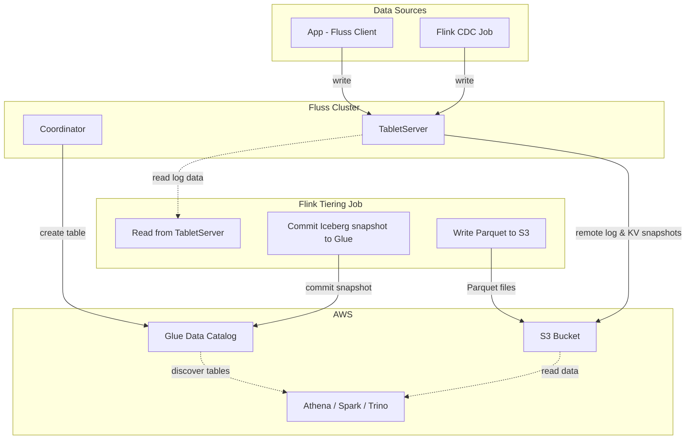

# AWS Glue

## Introduction

[AWS Glue](https://aws.amazon.com/glue/) is a serverless data integration service that includes a central metadata repository known as the AWS Glue Data Catalog. The Glue Data Catalog is compatible with Apache Iceberg, making it a convenient option for managing Iceberg table metadata on AWS.

This guide explains how to configure Fluss to use AWS Glue as its Iceberg catalog. For general Iceberg integration details (table mapping, data types, limitations), see [Iceberg](../datalake-formats/iceberg.md).

## How It Works

When Fluss is configured with AWS Glue as its Iceberg catalog:

1. **Data ingestion**: Applications write data to Fluss tables using the Fluss client (Java/Python) or Flink SQL. Fluss stores this data in its tables (log tables or primary key tables).
2. **Tiering to Iceberg**: A separate Flink job (the tiering service) periodically reads accumulated data from Fluss, converts it to Parquet format, writes the files to S3, and commits an Iceberg snapshot to the Glue Data Catalog.
3. **Query via Athena/Spark/Trino**: Any Iceberg-compatible engine can discover and query the tiered tables through AWS Glue — no additional configuration needed.



> **Note**: Flink is used here for the tiering service (Fluss → Iceberg/S3/Glue) and optionally for data ingestion via SQL. Applications can also write directly to Fluss using the client library (Java, Python). The tiering service is what bridges Fluss tables to the Glue Data Catalog.

## Prerequisites

### Java Version

Fluss requires **Java 11 or later**, with Java 17 recommended (see [Deploying Fluss](../../install-deploy/deploying-local-cluster.md)).

> **NOTE**: The 0.9.1 release binaries do not run on Java 11 — the Tablet Server fails with `NoSuchMethodError: MappedByteBuffer.duplicate()` because the release was compiled on a newer JDK. Use Java 17+ with the 0.9.1 binaries, or build Fluss from source on JDK 11.

### AWS IAM Permissions

The processes running Fluss servers and the Flink tiering service must have IAM permissions for both Glue and S3. Below is a minimal IAM policy:

```json
{
  "Version": "2012-10-17",
  "Statement": [
    {
      "Effect": "Allow",
      "Action": [
        "glue:CreateDatabase",
        "glue:GetDatabase",
        "glue:GetDatabases",
        "glue:DeleteDatabase",
        "glue:CreateTable",
        "glue:GetTable",
        "glue:GetTables",
        "glue:UpdateTable",
        "glue:DeleteTable"
      ],
      "Resource": [
        "arn:aws:glue:<region>:<account-id>:catalog",
        "arn:aws:glue:<region>:<account-id>:database/*",
        "arn:aws:glue:<region>:<account-id>:table/*"
      ]
    },
    {
      "Effect": "Allow",
      "Action": [
        "s3:GetObject",
        "s3:PutObject",
        "s3:DeleteObject",
        "s3:ListBucket"
      ],
      "Resource": [
        "arn:aws:s3:::<your-bucket>",
        "arn:aws:s3:::<your-bucket>/*"
      ]
    }
  ]
}
```

> **NOTE**: If your account uses **AWS Lake Formation**, the IAM role must also have Lake Formation permissions (Create Table, Describe, Alter, Insert, Select, Delete, Drop) on the target database. Standard IAM `glue:*` permissions alone are not sufficient when Lake Formation governance is enabled.

> **TIP**: The policy above uses broad wildcards for simplicity. In production, scope Glue resources to specific databases: `arn:aws:glue:<region>:<account-id>:database/<your-database>` and `arn:aws:glue:<region>:<account-id>:table/<your-database>/*`.

### Prepare Required JARs

Fluss bundles `iceberg-core` but does **not** bundle the Glue catalog implementation or the AWS SDK. You must supply additional JARs.

#### For Fluss Servers (Coordinator & Tablet Servers)

Place the following JARs in the `${FLUSS_HOME}/plugins/iceberg/` directory:

- **Iceberg AWS Bundle**: [iceberg-aws-bundle-1.10.1.jar](https://repo1.maven.org/maven2/org/apache/iceberg/iceberg-aws-bundle/1.10.1/iceberg-aws-bundle-1.10.1.jar)
- **Iceberg AWS**: [iceberg-aws-1.10.1.jar](https://repo1.maven.org/maven2/org/apache/iceberg/iceberg-aws/1.10.1/iceberg-aws-1.10.1.jar)
- **Failsafe**: [failsafe-3.3.2.jar](https://repo1.maven.org/maven2/dev/failsafe/failsafe/3.3.2/failsafe-3.3.2.jar) — required by `iceberg-aws` for Glue API retry logic

Both Iceberg JARs are required. The bundle provides AWS SDK v2 dependencies, while `iceberg-aws` provides the `GlueCatalog` class that Iceberg loads via reflection. The plugin classloader cannot find `GlueCatalog` from the bundle alone. The `failsafe` library is a transitive dependency of `iceberg-aws` that is not bundled.

> **NOTE**: You need **all three** JARs. Using only the bundle will result in `ClassNotFoundException: org.apache.iceberg.aws.glue.GlueCatalog`. Missing `failsafe` will cause `NoClassDefFoundError: dev/failsafe/FailsafeException`.

Additionally, you need the Fluss S3 filesystem plugin for remote storage access. Place [fluss-fs-s3-$FLUSS_VERSION$.jar]($FLUSS_MAVEN_REPO_URL$/org/apache/fluss/fluss-fs-s3/$FLUSS_VERSION$/fluss-fs-s3-$FLUSS_VERSION$.jar) in `${FLUSS_HOME}/plugins/s3/`. See [S3 Dependencies](../../maintenance/tiered-storage/filesystems/s3.md#dependencies) for details.

> **TIP**: The Fluss binary distribution already includes `fluss-lake-iceberg-$FLUSS_VERSION$.jar` in `plugins/iceberg/`. You do not need to download it separately — only add the three JARs above (iceberg-aws-bundle, iceberg-aws, failsafe).

#### For the Flink Tiering Service

Place the following JARs in `${FLINK_HOME}/lib`:

1. **Iceberg AWS Bundle**: `iceberg-aws-bundle-1.10.1.jar` (same as above)
2. **Iceberg AWS**: `iceberg-aws-1.10.1.jar` (same as above — provides `GlueCatalog` class)
3. **Failsafe**: `failsafe-3.3.2.jar` (same as above — Glue retry logic)
4. **Fluss Flink Connector**: [fluss-flink-1.20-$FLUSS_VERSION$.jar]($FLUSS_MAVEN_REPO_URL$/org/apache/fluss/fluss-flink-1.20/$FLUSS_VERSION$/fluss-flink-1.20-$FLUSS_VERSION$.jar) (pick the version matching your Flink runtime)
5. **Fluss Lake Iceberg**: [fluss-lake-iceberg-$FLUSS_VERSION$.jar]($FLUSS_MAVEN_REPO_URL$/org/apache/fluss/fluss-lake-iceberg/$FLUSS_VERSION$/fluss-lake-iceberg-$FLUSS_VERSION$.jar)
6. **Fluss Flink Tiering**: [fluss-flink-tiering-$FLUSS_VERSION$.jar]($FLUSS_MAVEN_REPO_URL$/org/apache/fluss/fluss-flink-tiering/$FLUSS_VERSION$/fluss-flink-tiering-$FLUSS_VERSION$.jar) — the tiering job JAR itself
7. **Fluss S3 Filesystem**: [fluss-fs-s3-$FLUSS_VERSION$.jar]($FLUSS_MAVEN_REPO_URL$/org/apache/fluss/fluss-fs-s3/$FLUSS_VERSION$/fluss-fs-s3-$FLUSS_VERSION$.jar) (if S3 is used as Fluss remote storage)
8. **Hadoop Client**: [hadoop-client-api-3.3.6.jar](https://repo1.maven.org/maven2/org/apache/hadoop/hadoop-client-api/3.3.6/hadoop-client-api-3.3.6.jar) and [hadoop-client-runtime-3.3.6.jar](https://repo1.maven.org/maven2/org/apache/hadoop/hadoop-client-runtime/3.3.6/hadoop-client-runtime-3.3.6.jar) — required by the Iceberg Parquet writer

> **NOTE**: Despite the Glue catalog itself not requiring Hadoop, the **tiering service** needs Hadoop classes (`org.apache.hadoop.conf.Configuration`) for writing Parquet files via Iceberg. Use the `hadoop-client-api` and `hadoop-client-runtime` JARs (not the full Hadoop distribution or `flink-shaded-hadoop-2-uber`) to avoid classpath conflicts with Flink's bundled Avro version. Using the uber JAR causes `NoSuchMethodError: LogicalTypes.timestampNanos()`.

> **WARNING**: Do **not** add S3 credentials to Flink's configuration file (`config.yaml` or `flink-conf.yaml`) by appending key-value pairs — this can break Flink's memory configuration parser. The credential provider chain configured in Fluss's `server.yaml` handles S3 access for the tiering service automatically.

## Configure Fluss with AWS Glue

### Cluster Configuration

Add the following to your `server.yaml`:

```yaml
datalake.format: iceberg
datalake.iceberg.type: glue
datalake.iceberg.warehouse: s3://<your-bucket>/<warehouse-path>
```

Fluss strips the `datalake.iceberg.` prefix and passes the remaining properties directly to Iceberg's Glue catalog. The properties above become `type=glue` and `warehouse=s3://...` when initializing the catalog.

You can pass any [Iceberg AWS catalog property](https://iceberg.apache.org/docs/1.10.1/aws/#glue-catalog) using the same prefix. Common additional properties:

```yaml
# Specify the AWS region (required if not using default region from credentials chain)
datalake.iceberg.client.region: us-east-1

# Use S3FileIO explicitly (Glue catalog defaults to this when warehouse is s3://)
datalake.iceberg.io-impl: org.apache.iceberg.aws.s3.S3FileIO

# Optional: use a Glue Data Catalog in another AWS account (defaults to the caller's account)
datalake.iceberg.glue.id: <aws-account-id>
```

#### Authentication

**Glue Catalog**: The Iceberg AWS SDK uses the [default credentials provider chain](https://docs.aws.amazon.com/sdk-for-java/latest/developer-guide/credentials-chain.html) automatically. If running on AWS (EKS, ECS, EC2) with an attached IAM role, no credential configuration is needed for the Glue catalog connection.

**S3 Filesystem Plugin**: The Fluss S3 filesystem plugin (used for `remote.data.dir`) requires explicit credential provider configuration. Add the following to `server.yaml`:

```yaml
# Tell Hadoop S3A which credential providers to use (in order of preference)
fs.s3a.aws.credentials.provider: <provider-class-list>
```

Choose the provider chain for your environment:

| Environment | Provider Chain |
|-------------|---------------|
| **ECS Fargate** | `com.amazonaws.auth.ContainerCredentialsProvider,com.amazonaws.auth.EnvironmentVariableCredentialsProvider,com.amazonaws.auth.InstanceProfileCredentialsProvider` |
| **EKS (IRSA)** | `com.amazonaws.auth.WebIdentityTokenCredentialsProvider,com.amazonaws.auth.EnvironmentVariableCredentialsProvider,com.amazonaws.auth.InstanceProfileCredentialsProvider` |
| **EC2 (instance profile)** | `com.amazonaws.auth.InstanceProfileCredentialsProvider` |

Example for ECS Fargate:

```yaml
fs.s3a.aws.credentials.provider: com.amazonaws.auth.ContainerCredentialsProvider,com.amazonaws.auth.EnvironmentVariableCredentialsProvider,com.amazonaws.auth.InstanceProfileCredentialsProvider
```

The credential provider chain handles automatic credential refresh — no static keys or manual token rotation needed.

> **NOTE**: For non-standard AWS regions (GovCloud, China), you must also set the S3 endpoint explicitly. Hadoop S3A defaults to `s3.amazonaws.com` which does not work for these partitions:
> ```yaml
> fs.s3a.endpoint: s3.us-gov-west-1.amazonaws.com   # GovCloud
> fs.s3a.endpoint: s3.cn-north-1.amazonaws.com.cn   # China
> ```

> **NOTE**: You may see a non-fatal warning: `"Session credentials from the configured AWS credentials provider are not supported for Fluss S3 client-token generation."` This is expected — the delegation token subsystem cannot generate tokens from session credentials, but the actual S3 file operations work correctly via the provider chain.

**Static Credentials (Testing Only)**:

For local development or testing environments where no IAM role is available:

```yaml
s3.access.key: <your-access-key>
s3.secret.key: <your-secret-key>
s3.endpoint: s3.<your-region>.amazonaws.com
```

### Start Tiering Service

Follow the [Iceberg tiering service setup](../datalake-formats/iceberg.md) to prepare the required JARs. Launch the Flink tiering job with Glue parameters:

```bash
${FLINK_HOME}/bin/flink run /path/to/fluss-flink-tiering-$FLUSS_VERSION$.jar \
    --fluss.bootstrap.servers <coordinator-host>:9123 \
    --datalake.format iceberg \
    --datalake.iceberg.type glue \
    --datalake.iceberg.warehouse s3://<your-bucket>/<warehouse-path> \
    --datalake.iceberg.client.region <your-aws-region> \
    --datalake.iceberg.io-impl org.apache.iceberg.aws.s3.S3FileIO
```

## Quick Start (Full Bootstrap)

This section shows the complete setup from a blank Linux machine to data queryable in Athena. Adapt paths and versions for your environment.

```bash
# — 1. Install prerequisites —
# Java 17+ required (Amazon Corretto, OpenJDK, etc.)
java -version  # Must show 17+

# — 2. Install ZooKeeper —
wget -q https://archive.apache.org/dist/zookeeper/zookeeper-3.8.4/apache-zookeeper-3.8.4-bin.tar.gz
tar -xzf apache-zookeeper-3.8.4-bin.tar.gz -C /opt/zookeeper --strip-components=1
cat > /opt/zookeeper/conf/zoo.cfg <<EOF
tickTime=2000
dataDir=/var/lib/zookeeper
clientPort=2181
EOF

# — 3. Install Fluss —
wget -q https://dlcdn.apache.org/incubator/fluss/fluss-0.9.1-incubating/fluss-0.9.1-incubating-bin.tgz
tar -xzf fluss-0.9.1-incubating-bin.tgz -C /opt/fluss --strip-components=1

# — 4. Add Glue JARs to Fluss plugins/iceberg/ —
wget -O /opt/fluss/plugins/iceberg/iceberg-aws-bundle-1.10.1.jar \
  https://repo1.maven.org/maven2/org/apache/iceberg/iceberg-aws-bundle/1.10.1/iceberg-aws-bundle-1.10.1.jar
wget -O /opt/fluss/plugins/iceberg/iceberg-aws-1.10.1.jar \
  https://repo1.maven.org/maven2/org/apache/iceberg/iceberg-aws/1.10.1/iceberg-aws-1.10.1.jar
wget -O /opt/fluss/plugins/iceberg/failsafe-3.3.2.jar \
  https://repo1.maven.org/maven2/dev/failsafe/failsafe/3.3.2/failsafe-3.3.2.jar

# — 5. Write server.yaml —
cat > /opt/fluss/conf/server.yaml <<EOF
zookeeper.address: localhost:2181
coordinator.host: localhost
coordinator.port: 9123
tablet-server.host: localhost
tablet-server.id: 0
tablet-server.port: 9124
data.dir: /var/lib/fluss/data
remote.data.dir: s3://YOUR-BUCKET/fluss-data

datalake.format: iceberg
datalake.iceberg.type: glue
datalake.iceberg.warehouse: s3://YOUR-BUCKET/iceberg-warehouse
datalake.iceberg.client.region: YOUR-REGION
datalake.iceberg.io-impl: org.apache.iceberg.aws.s3.S3FileIO

# S3 credentials — use the provider chain for your environment
# ECS Fargate:
fs.s3a.aws.credentials.provider: com.amazonaws.auth.ContainerCredentialsProvider,com.amazonaws.auth.EnvironmentVariableCredentialsProvider,com.amazonaws.auth.InstanceProfileCredentialsProvider
# EKS (IRSA): use WebIdentityTokenCredentialsProvider instead of ContainerCredentialsProvider
# EC2: use InstanceProfileCredentialsProvider alone

# Required for non-standard regions (GovCloud, China):
# fs.s3a.endpoint: s3.YOUR-REGION.amazonaws.com
EOF

# — 6. Start services —
/opt/zookeeper/bin/zkServer.sh start
sleep 3
/opt/fluss/bin/coordinator-server.sh start
sleep 5
/opt/fluss/bin/tablet-server.sh start
sleep 5

# — 7. Install Flink + tiering JARs —
wget -q https://archive.apache.org/dist/flink/flink-1.20.1/flink-1.20.1-bin-scala_2.12.tgz
tar -xzf flink-1.20.1-bin-scala_2.12.tgz -C /opt/flink --strip-components=1

# Copy/download all required JARs to Flink lib
cp /opt/fluss/plugins/iceberg/iceberg-aws-bundle-1.10.1.jar /opt/flink/lib/
cp /opt/fluss/plugins/iceberg/iceberg-aws-1.10.1.jar /opt/flink/lib/
cp /opt/fluss/plugins/iceberg/failsafe-3.3.2.jar /opt/flink/lib/
wget -O /opt/flink/lib/fluss-flink-1.20-0.9.1-incubating.jar \
  https://repo1.maven.org/maven2/org/apache/fluss/fluss-flink-1.20/0.9.1-incubating/fluss-flink-1.20-0.9.1-incubating.jar
wget -O /opt/flink/lib/fluss-lake-iceberg-0.9.1-incubating.jar \
  https://repo1.maven.org/maven2/org/apache/fluss/fluss-lake-iceberg/0.9.1-incubating/fluss-lake-iceberg-0.9.1-incubating.jar
wget -O /opt/flink/lib/fluss-flink-tiering-0.9.1-incubating.jar \
  https://repo1.maven.org/maven2/org/apache/fluss/fluss-flink-tiering/0.9.1-incubating/fluss-flink-tiering-0.9.1-incubating.jar
wget -O /opt/flink/lib/hadoop-client-api-3.3.6.jar \
  https://repo1.maven.org/maven2/org/apache/hadoop/hadoop-client-api/3.3.6/hadoop-client-api-3.3.6.jar
wget -O /opt/flink/lib/hadoop-client-runtime-3.3.6.jar \
  https://repo1.maven.org/maven2/org/apache/hadoop/hadoop-client-runtime/3.3.6/hadoop-client-runtime-3.3.6.jar

# Start Flink
/opt/flink/bin/start-cluster.sh
sleep 5

# — 8. Create table + insert data (single Flink SQL session) —
cat > /tmp/setup.sql <<EOF
CREATE CATALOG fluss_catalog WITH ('type' = 'fluss', 'bootstrap.servers' = 'localhost:9123');
USE CATALOG fluss_catalog;
CREATE DATABASE IF NOT EXISTS my_database;
USE my_database;
CREATE TABLE test_table (id BIGINT, name STRING, PRIMARY KEY (id) NOT ENFORCED)
  WITH ('table.datalake.enabled' = 'true', 'table.datalake.freshness' = '30s');
INSERT INTO test_table VALUES (1, 'hello'), (2, 'world');
EOF
/opt/flink/bin/sql-client.sh -f /tmp/setup.sql

# — 9. Start tiering service —
/opt/flink/bin/flink run -d /opt/flink/lib/fluss-flink-tiering-0.9.1-incubating.jar \
  --fluss.bootstrap.servers localhost:9123 \
  --datalake.format iceberg \
  --datalake.iceberg.type glue \
  --datalake.iceberg.warehouse s3://YOUR-BUCKET/iceberg-warehouse \
  --datalake.iceberg.client.region YOUR-REGION \
  --datalake.iceberg.io-impl org.apache.iceberg.aws.s3.S3FileIO

# — 10. Query in Athena —
# Wait ~30s for tiering to flush, then:
#   SELECT * FROM my_database.test_table;
```

## Usage Example

### Create a Datalake-Enabled Table

Connect to Fluss via Flink SQL and create a table with data lake tiering enabled:

```sql title="Flink SQL"
CREATE CATALOG fluss_catalog WITH (
    'type' = 'fluss',
    'bootstrap.servers' = '<coordinator-host>:9123'
);

USE CATALOG fluss_catalog;
CREATE DATABASE IF NOT EXISTS my_database;
USE my_database;

CREATE TABLE customer_orders (
    `order_id` BIGINT,
    `customer_name` STRING,
    `total_amount` DECIMAL(15, 2),
    `order_date` STRING,
    PRIMARY KEY (`order_id`) NOT ENFORCED
) WITH (
    'table.datalake.enabled' = 'true',
    'table.datalake.freshness' = '30s'
);
```

Fluss will register the database in ZooKeeper and create a corresponding Iceberg table in the Glue Data Catalog (using the same database name). Once data is ingested and the tiering service commits, Parquet files appear in the S3 warehouse path.

> **NOTE**: The database must be created in the Fluss catalog first — Fluss maintains its own database registry in ZooKeeper. The database name in Fluss maps 1:1 to the Glue database name during tiering.

### Query Data with Athena

AWS Athena uses the Glue Data Catalog by default, so tiered tables are immediately queryable:

```sql title="Athena SQL"
SELECT * FROM my_database.customer_orders LIMIT 10;
```

### Query Data with Flink (Union Read)

```sql title="Flink SQL"
SET 'execution.runtime-mode' = 'streaming';

-- Union read: starts from the Iceberg snapshot in Glue, then continues with the Fluss changelog
SELECT * FROM customer_orders;
```

> **NOTE**: For **primary key tables**, union reads work in **streaming** mode only — **batch** mode is not yet supported with the Iceberg lake format and fails with `UnsupportedOperationException`. In batch you can only query the **tiered data** — which excludes recent changes not yet tiered — either through Athena/Spark against the Iceberg table in Glue, or via `SELECT ... FROM customer_orders$lake` in Flink. Log tables (append-only, no primary key) support union reads in both modes.

For details on union reads and streaming reads, see [Union Read](../union-read.md) and [Iceberg - Read Tables](../datalake-formats/iceberg.md#read-tables).

## Troubleshooting

| Symptom | Likely Cause | Fix |
|---------|-------------|-----|
| `ClassNotFoundException: org.apache.iceberg.aws.glue.GlueCatalog` | Missing `iceberg-aws` JAR | Add `iceberg-aws-1.10.1.jar` alongside the bundle in `plugins/iceberg/` |
| `NoClassDefFoundError: dev/failsafe/FailsafeException` | Missing `failsafe` JAR | Add `failsafe-3.3.2.jar` to `plugins/iceberg/` and `${FLINK_HOME}/lib` |
| `NoClassDefFoundError: software/amazon/awssdk/...` | Missing AWS SDK | Ensure `iceberg-aws-bundle-1.10.1.jar` is in `plugins/iceberg/` and `${FLINK_HOME}/lib` |
| `NoClassDefFoundError: org/apache/hadoop/conf/Configuration` | Missing Hadoop JARs in tiering | Add `hadoop-client-api-3.3.6.jar` and `hadoop-client-runtime-3.3.6.jar` to `${FLINK_HOME}/lib` |
| `NoSuchMethodError: LogicalTypes.timestampNanos()` | Avro version conflict | Do NOT use `flink-shaded-hadoop-2-uber` — use `hadoop-client-api` + `hadoop-client-runtime` instead |
| `NoSuchMethodError: MappedByteBuffer.duplicate()` | 0.9.1 release binaries running on Java 11 | Use Java 17+ with the release binaries, or build Fluss from source on JDK 11 |
| `NoAwsCredentialsException` / `No AWS Credentials` | S3 plugin missing credential provider config | Set `fs.s3a.aws.credentials.provider` in `server.yaml` with the appropriate provider for your environment (see Authentication section above). |
| `SecurityTokenException: Region is not set` | S3 token manager missing region | Add `datalake.iceberg.client.region` and set `AWS_REGION` environment variable |
| `AccessDeniedException` from Glue API | Insufficient IAM or Lake Formation permissions | Check IAM policy includes `glue:CreateTable`. If Lake Formation is enabled, grant table-level permissions to the role. |
| `403 Forbidden` / `400 Bad Request` writing to S3 | S3 endpoint misconfigured for non-standard region | Set `fs.s3a.endpoint: s3.<region>.amazonaws.com` in `server.yaml`. Required for GovCloud (`s3.us-gov-west-1.amazonaws.com`) and China regions. |
| `Table already exists` on CREATE TABLE | Stale Iceberg metadata in Glue from previous run | DROP TABLE in Fluss first, or use a new table name. Glue retains metadata even after Fluss state (ZooKeeper) is reset. |
| `IllegalConfigurationException: JobManager memory configuration failed` | Flink config file corrupted | Do NOT append arbitrary key-value pairs to Flink's `config.yaml`. Use environment variables (`AWS_REGION`) for Flink configuration. |

## Further Reading

- [Iceberg Integration](../datalake-formats/iceberg.md) — Table mapping, data types, supported catalog types, and limitations
- [Streaming Lakehouse Overview](../overview.mdx) — General tiered storage concepts
- [S3 Filesystem](../../maintenance/tiered-storage/filesystems/s3.md) — Configuring S3 as Fluss remote storage
- [Iceberg AWS Docs](https://iceberg.apache.org/docs/1.10.1/aws/) — Full reference for Glue and S3 properties
