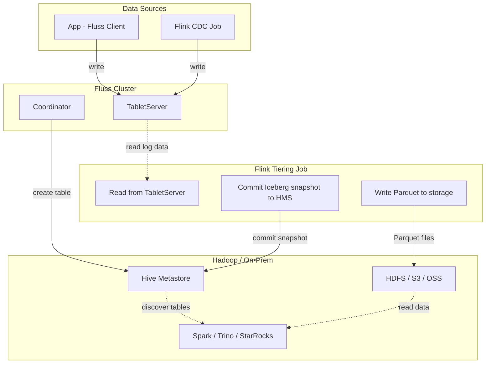

# Hive Metastore

## Introduction

The **Hive Metastore (HMS)** is a central metadata repository commonly used in Apache Hadoop and other big data ecosystems to store schema and metadata information for tables. Apache Iceberg provides native integration with Hive Metastore, storing Iceberg table names and metadata locations directly within HMS.

This guide explains how to configure Fluss to use Hive Metastore as its Iceberg catalog. For general Iceberg integration details (table mapping, data types, limitations), see [Iceberg](../datalake-formats/iceberg.md).

## How It Works

When Fluss is configured with Hive Metastore as its Iceberg catalog:

1. **Data ingestion**: Applications write data to Fluss tables using the Fluss client (Java/Python) or Flink SQL. Fluss stores this data in its log tables.
2. **Tiering to Iceberg**: A separate Flink job (the tiering service) periodically reads accumulated data from Fluss, converts it to Parquet format, writes the files to HDFS (or S3/OSS), and commits an Iceberg snapshot to the Hive Metastore.
3. **Query via Spark/Trino/Flink**: Any Iceberg-compatible engine configured with Hive catalog can discover and query the tiered tables through HMS.



> **Note**: The tiering service is a Flink job that bridges Fluss's log tables to Iceberg tables in Hive Metastore. Flink is also commonly used for data ingestion (via SQL), but applications can write directly to Fluss using the client library.

## Prerequisites

### Java Version

Fluss 0.9.x requires **Java 17 or later** for the Tablet Server.

### Running Hive Metastore

Ensure you have a running Hive Metastore service (version **2.x or 3.x**). By default, HMS listens on thrift port `9083` (e.g., `thrift://<metastore-host>:9083`).

:::warning Hive Metastore Version Compatibility
Iceberg 1.10.1 compiles its Hive catalog client against **Hive 2.3.10**. This client is compatible with HMS **2.x and 3.x** servers. HMS **4.x** uses an incompatible thrift protocol and will fail with `TApplicationException: Invalid method name: 'get_table'`. Use HMS 3.x or earlier.
:::

### Prepare Required JARs

Iceberg's Hive catalog class (`HiveCatalog`) is distributed separately from `iceberg-core` and requires the Hive metastore client, Hadoop, and several transitive dependencies. You must supply all of them.

#### For Fluss Servers (Coordinator & Tablet Servers)

Download and place the following JARs in the `${FLUSS_HOME}/plugins/iceberg/` directory:

| # | JAR | Size | Purpose |
|---|-----|------|---------|
| 1 | [iceberg-hive-metastore-1.10.1.jar](https://repo1.maven.org/maven2/org/apache/iceberg/iceberg-hive-metastore/1.10.1/iceberg-hive-metastore-1.10.1.jar) | 92 KB | Contains `HiveCatalog` class |
| 2 | [hive-exec-2.3.10.jar](https://repo1.maven.org/maven2/org/apache/hive/hive-exec/2.3.10/hive-exec-2.3.10.jar) | 46 MB | Uber JAR: bundles `HiveConf`, `HiveMetaStoreClient`, Thrift, Guava |
| 3 | [hadoop-client-api-3.3.6.jar](https://repo1.maven.org/maven2/org/apache/hadoop/hadoop-client-api/3.3.6/hadoop-client-api-3.3.6.jar) | 20 MB | Hadoop public API (`Configuration`, `FileSystem`) |
| 4 | [hadoop-client-runtime-3.3.6.jar](https://repo1.maven.org/maven2/org/apache/hadoop/hadoop-client-runtime/3.3.6/hadoop-client-runtime-3.3.6.jar) | 30 MB | Hadoop runtime implementations |
| 5 | [commons-logging-1.2.jar](https://repo1.maven.org/maven2/commons-logging/commons-logging/1.2/commons-logging-1.2.jar) | 62 KB | Logging facade required by Hadoop and Hive |
| 6 | [jackson-core-2.15.2.jar](https://repo1.maven.org/maven2/com/fasterxml/jackson/core/jackson-core/2.15.2/jackson-core-2.15.2.jar) | 571 KB | JSON processing |
| 7 | [jackson-databind-2.15.2.jar](https://repo1.maven.org/maven2/com/fasterxml/jackson/core/jackson-databind/2.15.2/jackson-databind-2.15.2.jar) | 1.5 MB | JSON data binding |
| 8 | [jackson-annotations-2.15.2.jar](https://repo1.maven.org/maven2/com/fasterxml/jackson/core/jackson-annotations/2.15.2/jackson-annotations-2.15.2.jar) | 75 KB | JSON annotations |

> **NOTE**: The Fluss binary distribution already includes `fluss-lake-iceberg-$FLUSS_VERSION$.jar` in `plugins/iceberg/`. You do not need to download it separately  only add the 8 JARs above.

> **TIP**: `hive-exec-2.3.10.jar` is a shaded uber JAR that bundles the Hive metastore client, `HiveConf`, Apache Thrift, libfb303, and Guava. Using the full `hive-exec` (not the `-core` variant) avoids needing to track down each transitive dependency individually. Despite its size, it is the simplest way to satisfy all Hive client requirements.

#### For the Flink Tiering Service

Place the following JARs in `${FLINK_HOME}/lib`:

1. **All 8 JARs listed above** (iceberg-hive-metastore, hive-exec, hadoop-client-api, hadoop-client-runtime, commons-logging, jackson-core, jackson-databind, jackson-annotations)
2. **Fluss Flink Connector**: [fluss-flink-1.20-$FLUSS_VERSION$.jar]($FLUSS_MAVEN_REPO_URL$/org/apache/fluss/fluss-flink-1.20/$FLUSS_VERSION$/fluss-flink-1.20-$FLUSS_VERSION$.jar) (pick the version matching your Flink runtime)
3. **Fluss Lake Iceberg**: [fluss-lake-iceberg-$FLUSS_VERSION$.jar]($FLUSS_MAVEN_REPO_URL$/org/apache/fluss/fluss-lake-iceberg/$FLUSS_VERSION$/fluss-lake-iceberg-$FLUSS_VERSION$.jar)
4. **Fluss Flink Tiering**: [fluss-flink-tiering-$FLUSS_VERSION$.jar]($FLUSS_MAVEN_REPO_URL$/org/apache/fluss/fluss-flink-tiering/$FLUSS_VERSION$/fluss-flink-tiering-$FLUSS_VERSION$.jar)  the tiering job JAR itself

### Hadoop Classpath Configuration (HDFS Only)

If your warehouse is on **HDFS**, both Fluss and Flink must be able to resolve HDFS paths. This requires Hadoop configuration files on the classpath.

**Option 1: Export Hadoop Classpath (Recommended)**

```bash
export HADOOP_CLASSPATH=`hadoop classpath`
```

**Option 2: Copy Hadoop XML Configs**

Copy `core-site.xml` and `hdfs-site.xml` to the configuration directories of both Fluss (`${FLUSS_HOME}/conf/`) and Flink (`${FLINK_HOME}/conf/`).

> **NOTE**: If your warehouse uses a local filesystem path (for testing) or S3/OSS (with the appropriate Fluss filesystem plugin), you do not need `HADOOP_CLASSPATH`.

## Configure Fluss with Hive Metastore

### Cluster Configuration

Add the following to your `server.yaml`:

```yaml
datalake.format: iceberg
datalake.iceberg.type: hive
datalake.iceberg.uri: thrift://<hive-metastore-host>:9083
datalake.iceberg.warehouse: hdfs://<namenode-host>:9000/user/hive/warehouse
```

Fluss strips the `datalake.iceberg.` prefix and passes the remaining properties directly to Iceberg's Hive catalog. The properties above become `type=hive`, `uri=thrift://...`, and `warehouse=hdfs://...` when initializing the catalog.

:::note
If your Hive warehouse is on cloud object storage, set `datalake.iceberg.warehouse` to the corresponding URI (e.g., `s3://<your-bucket>/warehouse`) and configure the required filesystem plugin. See [AWS Glue](glue.md) for S3 credential setup.
:::

### Start Tiering Service

Follow the [Iceberg tiering service setup](../datalake-formats/iceberg.md#start-tiering-service-to-iceberg) instructions to prepare the environment. Launch the Flink tiering job:

```bash
${FLINK_HOME}/bin/flink run /path/to/fluss-flink-tiering-$FLUSS_VERSION$.jar \
    --fluss.bootstrap.servers <coordinator-host>:9123 \
    --datalake.format iceberg \
    --datalake.iceberg.type hive \
    --datalake.iceberg.uri thrift://<hive-metastore-host>:9083 \
    --datalake.iceberg.warehouse hdfs://<namenode-host>:9000/user/hive/warehouse
```

## Quick Start (Docker Compose)

This section provides a complete docker-compose setup that runs the entire Hive Metastore integration end-to-end. It starts HMS, ZooKeeper, Fluss, Flink, creates a table, inserts data, tiers it to Iceberg via HMS, and reads it back. No cloud account or Hadoop cluster needed  everything runs locally.

**Prerequisites**: Docker and Docker Compose installed.

Create a `docker-compose.yml`:

```yaml
services:
  # Hive Metastore (Thrift on port 9083, embedded Derby)
  metastore:
    image: apache/hive:3.1.3
    environment:
      SERVICE_NAME: metastore
    ports:
      - "9083:9083"
    healthcheck:
      test: ["CMD-SHELL", "bash -c 'echo > /dev/tcp/localhost/9083' 2>/dev/null"]
      interval: 10s
      timeout: 10s
      retries: 15
      start_period: 90s

  zookeeper:
    image: zookeeper:3.8.4
    healthcheck:
      test: ["CMD", "zkServer.sh", "status"]
      interval: 5s
      timeout: 5s
      retries: 5

  # Downloads plugin JARs into a shared volume
  init-plugins:
    image: amazoncorretto:17
    entrypoint: ["/bin/bash", "-c"]
    command:
      - |
        set -e
        yum install -y curl 2>/dev/null
        mkdir -p /plugins/iceberg
        curl -sSfL -o /plugins/iceberg/iceberg-hive-metastore-1.10.1.jar \
          https://repo1.maven.org/maven2/org/apache/iceberg/iceberg-hive-metastore/1.10.1/iceberg-hive-metastore-1.10.1.jar
        curl -sSfL -o /plugins/iceberg/hive-exec-2.3.10.jar \
          https://repo1.maven.org/maven2/org/apache/hive/hive-exec/2.3.10/hive-exec-2.3.10.jar
        curl -sSfL -o /plugins/iceberg/hadoop-client-api-3.3.6.jar \
          https://repo1.maven.org/maven2/org/apache/hadoop/hadoop-client-api/3.3.6/hadoop-client-api-3.3.6.jar
        curl -sSfL -o /plugins/iceberg/hadoop-client-runtime-3.3.6.jar \
          https://repo1.maven.org/maven2/org/apache/hadoop/hadoop-client-runtime/3.3.6/hadoop-client-runtime-3.3.6.jar
        curl -sSfL -o /plugins/iceberg/commons-logging-1.2.jar \
          https://repo1.maven.org/maven2/commons-logging/commons-logging/1.2/commons-logging-1.2.jar
        curl -sSfL -o /plugins/iceberg/jackson-core-2.15.2.jar \
          https://repo1.maven.org/maven2/com/fasterxml/jackson/core/jackson-core/2.15.2/jackson-core-2.15.2.jar
        curl -sSfL -o /plugins/iceberg/jackson-databind-2.15.2.jar \
          https://repo1.maven.org/maven2/com/fasterxml/jackson/core/jackson-databind/2.15.2/jackson-databind-2.15.2.jar
        curl -sSfL -o /plugins/iceberg/jackson-annotations-2.15.2.jar \
          https://repo1.maven.org/maven2/com/fasterxml/jackson/core/jackson-annotations/2.15.2/jackson-annotations-2.15.2.jar
        echo 'Plugins ready:' && ls -la /plugins/iceberg/
    volumes:
      - fluss-plugins:/plugins

  coordinator:
    image: apache/fluss:$FLUSS_VERSION$
    command: coordinatorServer
    depends_on:
      zookeeper: { condition: service_healthy }
      metastore: { condition: service_healthy }
      init-plugins: { condition: service_completed_successfully }
    environment:
      - |
        FLUSS_PROPERTIES=
        zookeeper.address: zookeeper:2181
        coordinator.host: coordinator
        coordinator.port: 9123
        remote.data.dir: /tmp/fluss/remote-data
        datalake.format: iceberg
        datalake.iceberg.type: hive
        datalake.iceberg.uri: thrift://metastore:9083
        datalake.iceberg.warehouse: /tmp/fluss/warehouse
    volumes:
      - fluss-data:/tmp/fluss
      - fluss-plugins:/opt/fluss/plugins
    healthcheck:
      test: ["CMD-SHELL", "bash -c 'echo > /dev/tcp/coordinator/9123' 2>/dev/null"]
      interval: 10s
      timeout: 5s
      retries: 12
      start_period: 30s

  tablet-server:
    image: apache/fluss:$FLUSS_VERSION$
    command: tabletServer
    depends_on:
      coordinator: { condition: service_healthy }
    environment:
      - |
        FLUSS_PROPERTIES=
        zookeeper.address: zookeeper:2181
        tablet-server.host: tablet-server
        tablet-server.id: 0
        tablet-server.port: 9124
        data.dir: /tmp/fluss/data
        remote.data.dir: /tmp/fluss/remote-data
        datalake.format: iceberg
        datalake.iceberg.type: hive
        datalake.iceberg.uri: thrift://metastore:9083
        datalake.iceberg.warehouse: /tmp/fluss/warehouse
    volumes:
      - fluss-data:/tmp/fluss
      - fluss-plugins:/opt/fluss/plugins
    healthcheck:
      test: ["CMD-SHELL", "bash -c 'echo > /dev/tcp/tablet-server/9124' 2>/dev/null"]
      interval: 10s
      timeout: 5s
      retries: 12
      start_period: 30s

  # Flink: creates table, inserts data, starts tiering, reads back
  flink:
    image: amazoncorretto:17
    depends_on:
      tablet-server: { condition: service_healthy }
      metastore: { condition: service_healthy }
    entrypoint: ["/bin/bash", "-c"]
    command:
      - |
        set -e
        yum install -y wget tar gzip procps findutils 2>&1 | tail -3

        echo '=== Installing Flink 1.20.1 ==='
        mkdir -p /opt/flink
        wget -q https://archive.apache.org/dist/flink/flink-1.20.1/flink-1.20.1-bin-scala_2.12.tgz -O /tmp/flink.tgz
        tar -xzf /tmp/flink.tgz -C /opt/flink --strip-components=1 && rm /tmp/flink.tgz

        echo '=== Downloading Flink JARs ==='
        wget -q -O /opt/flink/lib/fluss-flink-1.20-0.9.1-incubating.jar https://repo1.maven.org/maven2/org/apache/fluss/fluss-flink-1.20/0.9.1-incubating/fluss-flink-1.20-0.9.1-incubating.jar
        wget -q -O /opt/flink/lib/fluss-lake-iceberg-0.9.1-incubating.jar https://repo1.maven.org/maven2/org/apache/fluss/fluss-lake-iceberg/0.9.1-incubating/fluss-lake-iceberg-0.9.1-incubating.jar
        wget -q -O /opt/flink/lib/fluss-flink-tiering-0.9.1-incubating.jar https://repo1.maven.org/maven2/org/apache/fluss/fluss-flink-tiering/0.9.1-incubating/fluss-flink-tiering-0.9.1-incubating.jar
        wget -q -O /opt/flink/lib/iceberg-hive-metastore-1.10.1.jar https://repo1.maven.org/maven2/org/apache/iceberg/iceberg-hive-metastore/1.10.1/iceberg-hive-metastore-1.10.1.jar
        wget -q -O /opt/flink/lib/hive-exec-2.3.10.jar https://repo1.maven.org/maven2/org/apache/hive/hive-exec/2.3.10/hive-exec-2.3.10.jar
        wget -q -O /opt/flink/lib/hadoop-client-api-3.3.6.jar https://repo1.maven.org/maven2/org/apache/hadoop/hadoop-client-api/3.3.6/hadoop-client-api-3.3.6.jar
        wget -q -O /opt/flink/lib/hadoop-client-runtime-3.3.6.jar https://repo1.maven.org/maven2/org/apache/hadoop/hadoop-client-runtime/3.3.6/hadoop-client-runtime-3.3.6.jar
        wget -q -O /opt/flink/lib/commons-logging-1.2.jar https://repo1.maven.org/maven2/commons-logging/commons-logging/1.2/commons-logging-1.2.jar
        wget -q -O /opt/flink/lib/jackson-core-2.15.2.jar https://repo1.maven.org/maven2/com/fasterxml/jackson/core/jackson-core/2.15.2/jackson-core-2.15.2.jar
        wget -q -O /opt/flink/lib/jackson-databind-2.15.2.jar https://repo1.maven.org/maven2/com/fasterxml/jackson/core/jackson-databind/2.15.2/jackson-databind-2.15.2.jar
        wget -q -O /opt/flink/lib/jackson-annotations-2.15.2.jar https://repo1.maven.org/maven2/com/fasterxml/jackson/core/jackson-annotations/2.15.2/jackson-annotations-2.15.2.jar

        echo '=== Starting Flink ==='
        /opt/flink/bin/start-cluster.sh && sleep 10

        echo '=== Creating table + inserting data ==='
        cat > /tmp/setup.sql << 'SQLEOF'
        CREATE CATALOG fluss_catalog WITH ('type' = 'fluss', 'bootstrap.servers' = 'coordinator:9123');
        USE CATALOG fluss_catalog;
        CREATE DATABASE IF NOT EXISTS hive_test_db;
        USE hive_test_db;
        CREATE TABLE hive_validation (
            `event_id` BIGINT,
            `event_type` STRING,
            `severity` STRING,
            `event_date` STRING,
            PRIMARY KEY (`event_id`) NOT ENFORCED
        ) WITH (
            'table.datalake.enabled' = 'true',
            'table.datalake.freshness' = '30s'
        );
        INSERT INTO hive_validation VALUES (1, 'login', 'INFO', '2024-01-01'), (2, 'error', 'CRITICAL', '2024-01-02'), (3, 'logout', 'INFO', '2024-01-03');
        SQLEOF
        sed -i 's/^        //' /tmp/setup.sql
        /opt/flink/bin/sql-client.sh -f /tmp/setup.sql

        echo '=== Starting tiering service ==='
        /opt/flink/bin/flink run -d /opt/flink/lib/fluss-flink-tiering-0.9.1-incubating.jar \
          --fluss.bootstrap.servers coordinator:9123 \
          --datalake.format iceberg \
          --datalake.iceberg.type hive \
          --datalake.iceberg.uri thrift://metastore:9083 \
          --datalake.iceberg.warehouse /tmp/fluss/warehouse

        echo '=== Waiting 60s for tiering to flush ==='
        sleep 60

        echo '=== Reading data back ==='
        cat > /tmp/read.sql << 'SQLEOF'
        CREATE CATALOG fluss_catalog WITH ('type' = 'fluss', 'bootstrap.servers' = 'coordinator:9123');
        USE CATALOG fluss_catalog;
        USE hive_test_db;
        SET 'sql-client.execution.result-mode' = 'TABLEAU';
        SET 'execution.runtime-mode' = 'streaming';
        SELECT * FROM hive_validation LIMIT 3;
        SQLEOF
        sed -i 's/^        //' /tmp/read.sql
        /opt/flink/bin/sql-client.sh -f /tmp/read.sql

        echo '=== DONE ==='
        sleep 3600
    volumes:
      - fluss-data:/tmp/fluss

volumes:
  fluss-data:
  fluss-plugins:
```

Run it:

```bash
docker compose up
```

Watch the `flink` container logs. After about 3ΓÇô4 minutes (JAR downloads + tiering flush), you should see:

```
+----+----------+------------+----------+------------+
| op | event_id | event_type | severity | event_date |
+----+----------+------------+----------+------------+
| +I |        1 |      login |     INFO | 2024-01-01 |
| +I |        2 |      error | CRITICAL | 2024-01-02 |
| +I |        3 |     logout |     INFO | 2024-01-03 |
+----+----------+------------+----------+------------+
Received a total of 3 rows
```

Clean up when done:

```bash
docker compose down -v
```

## Usage Example

### Create a Datalake-Enabled Table

Connect to Fluss via Flink SQL and create a table with data lake tiering enabled:

```sql title="Flink SQL"
CREATE CATALOG fluss_catalog WITH (
    'type' = 'fluss',
    'bootstrap.servers' = '<coordinator-host>:9123'
);

USE CATALOG fluss_catalog;
CREATE DATABASE IF NOT EXISTS my_database;
USE my_database;

CREATE TABLE daily_events (
    `event_id` BIGINT,
    `event_type` STRING,
    `severity` STRING,
    `event_date` STRING,
    PRIMARY KEY (`event_id`) NOT ENFORCED
) WITH (
    'table.datalake.enabled' = 'true',
    'table.datalake.freshness' = '30s'
);
```

Fluss will create a corresponding Iceberg table in the Hive Metastore under the database matching your Fluss namespace. Once data is ingested and the tiering service commits a snapshot, Parquet files appear in the warehouse path and the table becomes queryable via HMS.

> **NOTE**: The database must be created in the Fluss catalog first  Fluss maintains its own database registry in ZooKeeper. The database name in Fluss maps 1:1 to the HMS database name during tiering.

### Query Data with Spark

Since HMS manages the metadata, you can register HMS as an Iceberg catalog in Apache Spark and query the tiered table immediately:

```sql title="Spark SQL"
-- Query the tiered Iceberg table from Hive Metastore catalog
SELECT * FROM hive_catalog.my_database.daily_events;
```

### Query Data with Flink (Union Read)

```sql title="Flink SQL"
-- Union read: combines fresh data in Fluss with historical data in Iceberg
SET 'execution.runtime-mode' = 'streaming';
SELECT * FROM daily_events;
```

> **NOTE**: Union reads for **primary key tables** with the Iceberg lake format are not yet supported. If your table has a primary key, query tiered data directly through Spark/Trino (which reads from the Iceberg snapshot in Hive Metastore) or read from the Fluss log only. Union reads work for log tables (append-only, no primary key).

For details on union reads and streaming reads, see [Iceberg - Read Tables](../datalake-formats/iceberg.md#read-tables).

## Troubleshooting

| Symptom | Likely Cause | Fix |
|---------|-------------|-----|
| `ClassNotFoundException: org.apache.iceberg.hive.HiveCatalog` | Missing `iceberg-hive-metastore` JAR | Add `iceberg-hive-metastore-1.10.1.jar` to `plugins/iceberg/` |
| `NoClassDefFoundError: org/apache/thrift/TBase` | Missing Thrift classes | Ensure `hive-exec-2.3.10.jar` (full, not `-core`) is in `plugins/iceberg/` |
| `ClassNotFoundException: org.apache.hadoop.hive.conf.HiveConf$ConfVars` | Missing HiveConf | Use the full `hive-exec-2.3.10.jar` uber JAR (not `hive-exec-core`) |
| `NoClassDefFoundError: org/apache/commons/logging/LogFactory` | Missing commons-logging | Add `commons-logging-1.2.jar` to `plugins/iceberg/` |
| `ClassNotFoundException: com.fasterxml.jackson.core.JsonProcessingException` | Missing Jackson | Add `jackson-core`, `jackson-databind`, `jackson-annotations` JARs to `plugins/iceberg/` |
| `TApplicationException: Invalid method name: 'get_table'` | HMS 4.x incompatibility | Use HMS **2.x or 3.x** (not 4.x). Iceberg's Hive client targets Hive 2.3.x which is incompatible with the HMS 4.x thrift protocol |
| `NoClassDefFoundError: com/google/common/collect/ImmutableMap` | Missing Guava | Ensure you're using the full `hive-exec-2.3.10.jar` (it bundles Guava internally) |
| `NoSuchMethodError: MappedByteBuffer.duplicate()` | Java version too old | Fluss 0.9.x requires **Java 17+**. Upgrade from Java 11. |

## Further Reading

- [Iceberg Integration](../datalake-formats/iceberg.md)  Table mapping, data types, and configurations.
- [Lakehouse Storage](maintenance/tiered-storage/lakehouse-storage.md)  General tiered storage overview.
- [AWS Glue Catalog](glue.md)  Alternative Iceberg catalog for AWS environments.
- [Iceberg Hive Catalog Docs](https://iceberg.apache.org/docs/latest/hive/)  Official Iceberg Hive documentation.
