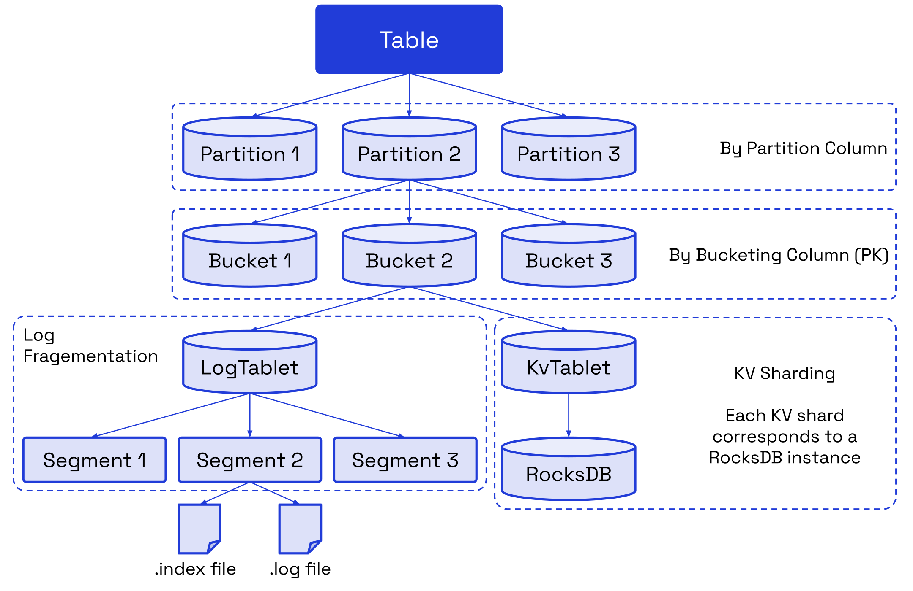

# Table Overview

## Database

In Fluss, a Table serves as the core unit of user data storage, structured into rows and columns. Tables are organized hierarchically within databases, following the format: database → table.

Tables are categorized into two types based on the presence of a primary key:

- **Log Tables:** are optimized for append-only workloads and support only `INSERT` operations.
- **Primary Key Tables:** are designed for managing and updating data in business applications. They support `INSERT`, `UPDATE`, and `DELETE` operations, based on a primary key.

Tables can also be partitioned (see [partitioned tables](../table-design/data-distribution/partitioning.md)) by defining a partition column, enabling efficient data organization. Partitioned tables store rows with the same partition value in a single partition. Partitioning applies to both Log Tables and Primary Key Tables, with specific considerations:
- **Log Tables:** Partitioning is typically used for log data (e.g., date-based columns) to streamline data separation and retention processes.
- **Primary Key Tables:** Partition columns must be a subset of the primary key to maintain data integrity and ensure uniqueness.

This design ensures efficient data management, supports diverse use cases, and enforces data integrity constraints while offering flexibility for both operational and analytical workloads.

## Table Data Organization

### Partition
A **partition** is a logical division of a table's data into smaller, more manageable subsets based on the values of one or more specified columns, known as partition columns.
Each unique value (or combination of values) in the partition column(s) defines a distinct partition.

### Bucket
A bucket divides the data of a table/partition into `N` buckets according to the bucketing policy.
The number of buckets `N` can be configured per table. A bucket is the smallest unit of data migration and backup.
The data of a bucket consists of a LogTablet and a (optional) KvTablet.

### LogTablet
A LogTablet needs to be generated for each bucket of Log and Primary Key tables.
For Log Tables, the LogTablet is both the primary table data and the log data. For Primary Key tables, the LogTablet acts
as the log data for the primary table data.
- **Segment:** The smallest unit of log storage in the **LogTablet**. A segment consists of an **.index** file and a **.log** data file.
- **.index:** An `offset sparse index` that stores the mappings between the physical byte address in the message relative offset -> .log file.
- **.log:** Compact arrangement of log data.

### KvTablet
Each bucket of the Primary Key table needs to generate a KvTablet. Underlying, each KvTablet corresponds to an embedded RocksDB instance. RocksDB is an LSM (log structured merge) engine which helps KvTablets support high-performance updates and lookup queries.

